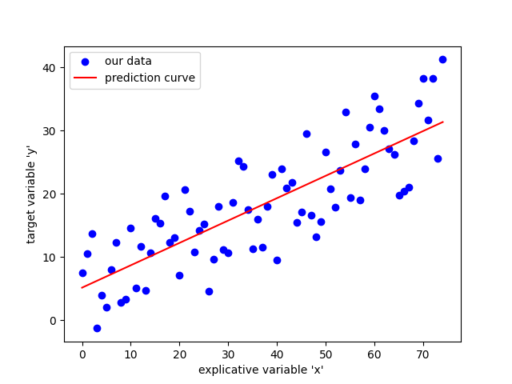

# MachineLearning

## Prérequis

- Python
- Librairies Python :
  - Jupyter Notebook
  - pandas
  - numpy
  - scikit-learn
  - matplotlib
  - seaborn

`pip install -r requirements.txt`

## Ressources

- [Site pour la regression lineaire](https://courses.dallard.tech/ml/notebooks/CODE_Regression_lineaire_simple/#practical-example-predict-the-salary-based-on-years-of-exeprience)

- [Cours sur pandas](https://courses.dallard.tech/python/notebooks/pandascourse/)

## Exercices

- Initiation à la regression linéaire simple
  - [code jupyter](initiationLinearRegressionSimple.ipynb)

    
